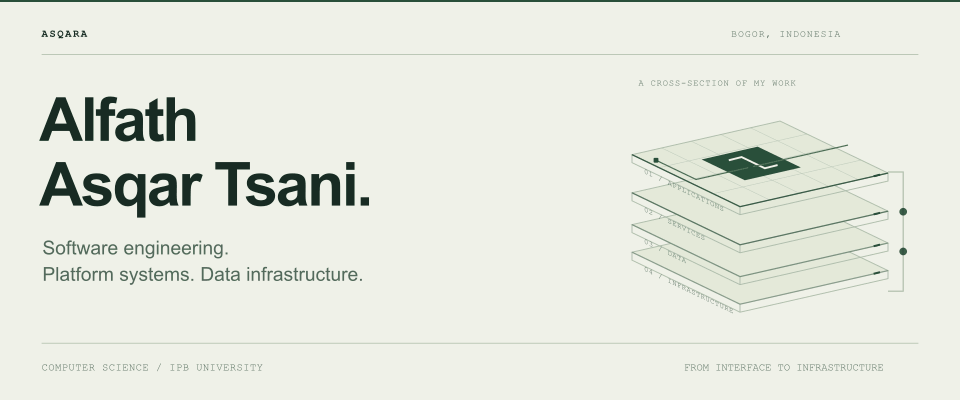
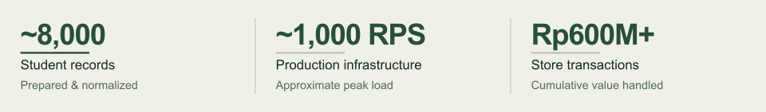

<picture>
  <source media="(prefers-reduced-motion: reduce) and (prefers-color-scheme: dark) and (max-width: 1100px)" srcset="assets/hero-dark-mobile.svg">
  <source media="(prefers-reduced-motion: reduce) and (max-width: 1100px)" srcset="assets/hero-light-mobile.svg">
  <source media="(prefers-reduced-motion: reduce) and (prefers-color-scheme: dark)" srcset="assets/hero-dark.svg">
  <source media="(prefers-reduced-motion: reduce)" srcset="assets/hero-light.svg">
  <source media="(prefers-color-scheme: dark) and (max-width: 1100px)" srcset="assets/hero-dark-mobile.gif">
  <source media="(max-width: 1100px)" srcset="assets/hero-light-mobile.gif">
  <source media="(prefers-color-scheme: dark)" srcset="assets/hero-dark.gif">
  
</picture>

  <a href="https://github.com/Asqara">GitHub</a> &nbsp; / &nbsp;
  <a href="https://www.linkedin.com/in/asqaraa">LinkedIn</a> &nbsp; / &nbsp;
  <a href="mailto:Alfath.asqartsani@gmail.com">Email</a> &nbsp; / &nbsp;
  <a href="README-static.md">View without animation</a>

# Software for real operations.

I'm **Alfath**, a Computer Science student at **IPB University**, based in Bogor, Indonesia. I build and maintain software for university operations, student services, and commerce-with work spanning applications, databases, service integration, and production infrastructure.

<picture>
  <source media="(prefers-reduced-motion: reduce) and (prefers-color-scheme: dark) and (max-width: 1100px)" srcset="assets/impact-dark-mobile.svg">
  <source media="(prefers-reduced-motion: reduce) and (max-width: 1100px)" srcset="assets/impact-light-mobile.svg">
  <source media="(prefers-reduced-motion: reduce) and (prefers-color-scheme: dark)" srcset="assets/impact-dark.svg">
  <source media="(prefers-reduced-motion: reduce)" srcset="assets/impact-light.svg">
  <source media="(prefers-color-scheme: dark) and (max-width: 1100px)" srcset="assets/impact-dark-mobile.gif">
  <source media="(max-width: 1100px)" srcset="assets/impact-light-mobile.gif">
  <source media="(prefers-color-scheme: dark)" srcset="assets/impact-dark.gif">
  
</picture>

[Selected systems](#selected-systems) &nbsp; / &nbsp; [Engineering](#engineering) &nbsp; / &nbsp; [Experience](#experience)

## Selected systems

### 01 / MySOC

**Integrated ERP** · OMB IPB 63 × Agrisymphony 2026

An internal platform connecting committee workflows, participant management, administration, and institutional stakeholders.

- Designed interconnected services for distinct operational domains and integrated their data and workflows.
- Managed role-based authorization for participants, committees, administrators, and institutional users.
- Handled Kubernetes deployment, scaling, service recovery, and production operations.

`Next.js` `Bun` `PostgreSQL` `Redis` `Drizzle ORM` `Docker` `Kubernetes`

### 02 / StudentOrientation

**Student platform** · IPB University

A student-facing platform supporting orientation information, digital services, and operational workflows.

- Cleaned and normalized data from multiple sources for approximately **8,000 incoming students**.
- Supported digital attendance, participant verification, and student grouping.
- Integrated authentication, information services, helpdesk, and operational systems.

`Next.js` `React` `PostgreSQL` `Tailwind CSS` `React Query` `next-intl`

### 03 / Agrisymphony Store

**Commerce & transactions** · MPKMB & Agrisymphony

A merchandise platform supporting products, orders, transactions, and day-to-day merchandise operations.

- Supported product catalog and merchandise workflows.
- Handled ordering flows and their associated transaction records.
- The platform handled **more than Rp600 million in cumulative transaction value**.

### 04 / Agrisymphony

**Public website & ticketing** · Event operations

A public-facing platform for event information, audience access, and official Agrisymphony ticket sales.

- Developed the event information platform and ticket purchasing and management workflows.
- Processed **more than 1,000 ticket sales** during the event period.
- Supported deployment and application reliability throughout event operations.

## Engineering

My work extends from the application layer into database design, data preparation, deployment, and maintenance. I work on the operational foundations that let connected services share data and support production usage.

<strong>Production infrastructure</strong> - deployment, recovery, and operations

 

- **Containers:** Docker-based application deployment.
- **Orchestration:** Kubernetes / k3s service management, scaling, and recovery.
- **Data services:** PostgreSQL database operations and Redis.
- **Operations:** Linux, deployment, production maintenance, and support during high-traffic periods.

Production infrastructure has handled peak loads of approximately **1,000 requests per second**.

<strong>Student data infrastructure</strong> - from raw sources to shared services

 

For OMB IPB 63, student information arrived from multiple sources and operational units. I prepared, cleaned, validated, and normalized data for approximately **8,000 incoming students** so the same structured data could be reused across services.

The resulting data supports **digital attendance, participant grouping, authentication, helpdesk, and internal operations**.

<strong>Tools I work with</strong>

 

- **Main stack:** TypeScript, JavaScript, Next.js, React, Bun, PostgreSQL, Redis, Docker, Kubernetes, Linux, Git, GitHub.
- **Development:** Python, PHP, C++, Java, Laravel, Tailwind CSS, MySQL, MongoDB, Figma.
- **Tooling & automation:** Drizzle ORM, React Query, Playwright, pnpm, n8n, Baileys, next-intl, Inertia.js, Node.js.

## Experience

- **2025 - Present · Information Systems Coordinator**  
  OMB IPB 63 × Agrisymphony 2026
- **2025 - Present · Web Developer**  
  Code Panda
- **2025 · Web Developer**  
  Agrisymphony
- **2025 · Head of Research & Development**  
  Ormawa Eksekutif PKU IPB
- **2024 · Data Operations**  
  Balai Penyuluhan Pertanian Bekri

<strong>More engineering work</strong> - applications, automation, and research

 

**Code Panda**  
Working on production web applications with Laravel, Inertia.js, and Next.js. Developed a Learning Management System for MBKM workflows, contributed to development, debugging, and maintenance, and improved Next.js page-load performance by approximately **60%**.

**WhatsApp automation**  
Built systems for student services and operational communication using JavaScript, Node.js, and Baileys. Work included automated helpdesk workflows, broadcasts, batch message processing, session management, and internal service automation.

**Moodle automation**  
Developed Playwright browser automation for repetitive operational work, including participant management and administrative processes.

**Research & data analysis**  
Worked with quantitative survey data from **700+ respondents**, using Python and spreadsheets to process responses and translate findings into organizational insights.

## Education & certification

**IPB University** · B.Sc. Computer Science, in progress  
Expected graduation **2028** · GPA **3.80 / 4.00**  
Recipient of the **Yayasan Alumni Peduli IPB Scholarship**.

**BNSP** · Web Developer Competency Certification  
Badan Nasional Sertifikasi Profesi

---

Currently interested in **backend engineering, system architecture, distributed systems, database architecture, platform engineering, and DevOps**.

[Get in touch](mailto:Alfath.asqartsani@gmail.com) &nbsp; / &nbsp; [LinkedIn](https://www.linkedin.com/in/asqaraa) &nbsp; / &nbsp; [GitHub](https://github.com/Asqara)
