

<a href="https://asqara.tech">
<picture>
  <source media="(prefers-color-scheme: dark)" srcset="assets/hero-dark.svg">
  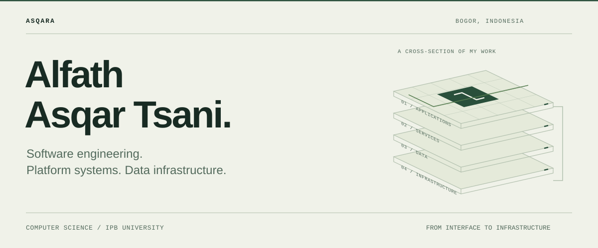
</picture>
</a>

<a href="https://asqara.tech">
<picture>
  <source media="(prefers-color-scheme: dark)" srcset="https://readme-typing-svg.demolab.com?font=Geist+Mono&weight=500&size=17&duration=2600&pause=900&color=D7FF3F&center=true&vCenter=true&width=720&lines=%2F%2F+full-stack+applications;%2F%2F+data+infrastructure+for+~8%2C000+students;%2F%2F+production+systems+%40+~1%2C000+RPS;%2F%2F+kubernetes+%2F+k3s+operations;%2F%2F+function+over+noise.">
  
</picture>
</a>

 

 

<picture>
  <source media="(prefers-color-scheme: dark)" srcset="assets/marquee-dark.svg">
  
</picture>

<picture>
  <source media="(prefers-color-scheme: dark)" srcset="assets/metrics-dark.svg">
  
</picture>

  

<!-- ───────────────────────── ABOUT ───────────────────────── -->
<picture>
  <source media="(prefers-color-scheme: dark)" srcset="assets/section/about-dark.svg">
  
</picture>

I'm a Computer Science student at **IPB University** 🎓 working across
**full-stack development, backend systems, data infrastructure, and production operations**.

Most of my recent work involves building systems that support real operational
workflows at university scale — from internal ERP and student-facing platforms
to data infrastructure, commerce systems, automation, and Kubernetes deployments.

My work usually spans more than the application layer: I also work with
**database design, data normalization, service integration, deployment,
infrastructure, and production maintenance**.

<table>
<tr>
<td align="center" width="25%"> <b>FULL-STACK</b> Next.js · React · Laravel</td>
<td align="center" width="25%"> <b>BACKEND</b> Bun · Elysia · RBAC</td>
<td align="center" width="25%"> <b>DATA</b> PostgreSQL · Redis · Drizzle</td>
<td align="center" width="25%"> <b>PLATFORM</b> Docker · k8s / k3s · Linux</td>
</tr>
</table>

 

<!-- ───────────────────────── PRINCIPLES ───────────────────────── -->
<picture>
  <source media="(prefers-color-scheme: dark)" srcset="assets/section/principles-dark.svg">
  
</picture>

<picture>
  <source media="(prefers-color-scheme: dark)" srcset="assets/principles-dark.svg">
  
</picture>

  

<!-- ───────────────────────── SELECTED WORK ───────────────────────── -->
<picture>
  <source media="(prefers-color-scheme: dark)" srcset="assets/section/work-dark.svg">
  
</picture>

<table>
<tr>
<td width="50%" valign="top">

<a href="https://asqara.tech/id#work">
<picture>
  <source media="(prefers-color-scheme: dark)" srcset="assets/projects/mysoc-dark.svg">
  
</picture>
</a>

🏛️ <b>Integrated ERP</b> · OMB IPB 63 × Agrisymphony 2026

<b>⚙️ Engineering scope</b>

 

 
Designed interconnected services for different operational domains.

 
Managed authorization across participants, committees, administrators, and institutional users.

 
Connected operational data and workflows across internal services.

 
Handled deployment, scaling, service recovery, and production operations.

<b>Built with</b> 

</td>
<td width="50%" valign="top">

<a href="https://asqara.tech/id#work">
<picture>
  <source media="(prefers-color-scheme: dark)" srcset="assets/projects/helpdesk-dark.svg">
  
</picture>
</a>

🛟 <b>Support Experience</b> · OMB IPB 63 × Agrisymphony 2026

<b>⚙️ Engineering scope</b>

 

 
A focused help center that gives participants one trusted place to find guidance and support.

<b>Focus</b> 

<b>Built with</b> 

</td>
</tr>

<tr>
<td width="50%" valign="top">

<a href="https://asqara.tech/id#work">
<picture>
  <source media="(prefers-color-scheme: dark)" srcset="assets/projects/studentorientation-dark.svg">
  
</picture>
</a>

🎓 <b>Student Platform</b> · IPB University

<b>⚙️ Engineering scope</b>

 

 
Cleaned and normalized student data coming from multiple operational sources.

 
Structured reusable student data for university-scale operations.

 
Supported attendance, participant verification, and student grouping workflows.

 
Integrated authentication, information services, and operational systems.

<b>Built with</b> 

</td>
<td width="50%" valign="top">

<a href="https://asqara.tech/id#work">
<picture>
  <source media="(prefers-color-scheme: dark)" srcset="assets/projects/ormawa-dark.svg">
  
</picture>
</a>

🏢 <b>Organization Platform</b> · PKU IPB

<b>⚙️ Engineering scope</b>

 

 
Public information and publication platform for one of the largest student organizations at PKU IPB.

<b>Built with</b> 

</td>
</tr>

<tr>
<td width="50%" valign="top">

<a href="https://asqara.tech/id#work">
<picture>
  <source media="(prefers-color-scheme: dark)" srcset="assets/projects/store-dark.svg">
  
</picture>
</a>

🛒 <b>Commerce & Transaction Platform</b> · MPKMB × Agrisymphony

<b>⚙️ Engineering scope</b>

 

 
Supported merchandise catalog and product workflows.

 
Handled ordering workflows and associated transaction records.

 
More than Rp600 million in cumulative transaction value handled through the platform.

<b>Focus</b> 

</td>
<td width="50%" valign="top">

<a href="https://asqara.tech/id#work">
<picture>
  <source media="(prefers-color-scheme: dark)" srcset="assets/projects/agrisymphony-dark.svg">
  
</picture>
</a>

🎟️ <b>Public Website & Ticketing</b> · Agrisymphony

<b>⚙️ Engineering scope</b>

 

 
Developed the public-facing event information platform.

 
Built workflows supporting event ticket purchasing and management.

 
Processed more than 1,000 ticket sales during the event period.

 
Supported deployment and application reliability throughout event operations.

<b>Focus</b> 

</td>
</tr>
</table>

<picture>
  <source media="(prefers-color-scheme: dark)" srcset="assets/marquee-dark.svg">
  
</picture>

  

<!-- ───────────────────────── PLATFORM ───────────────────────── -->
<picture>
  <source media="(prefers-color-scheme: dark)" srcset="assets/section/platform-dark.svg">
  
</picture>

A significant part of my work happens **beyond the UI** — keeping interconnected
systems available during production usage and high-traffic periods.

<picture>
  <source media="(prefers-color-scheme: dark)" srcset="assets/platform-dark.svg">
  
</picture>

<table>
<tr>
<td width="25%" align="center">
 
<b>Containerization</b> 
Docker-based application deployments
</td>
<td width="25%" align="center">
 
<b>Orchestration</b> 
Kubernetes / k3s service management
</td>
<td width="25%" align="center">
 
<b>Data</b> 
Production database operations
</td>
<td width="25%" align="center">
 
<b>Operations</b> 
Deployment, recovery, and maintenance
</td>
</tr>
</table>

 

<!-- ───────────────────────── DATA ───────────────────────── -->
<picture>
  <source media="(prefers-color-scheme: dark)" srcset="assets/section/data-dark.svg">
  
</picture>

For **OMB IPB 63**, student information came from multiple sources and operational units.
I prepared, cleaned, validated, and normalized data for approximately **8,000 incoming students**
so the same structured data could be reused across different services.

<picture>
  <source media="(prefers-color-scheme: dark)" srcset="assets/pipeline-dark.svg">
  
</picture>

 

<!-- ───────────────────────── STACK ───────────────────────── -->
<picture>
  <source media="(prefers-color-scheme: dark)" srcset="assets/section/stack-dark.svg">
  
</picture>

<table>
<tr>
<td width="22%"><code>01</code> <b>Applications</b></td>
<td>

</td>
</tr>
<tr>
<td><code>02</code> <b>Languages</b></td>
<td></td>
</tr>
<tr>
<td><code>03</code> <b>Data</b></td>
<td>

</td>
</tr>
<tr>
<td><code>04</code> <b>Infrastructure</b></td>
<td>

</td>
</tr>
<tr>
<td><code>05</code> <b>Tooling</b></td>
<td>
 

</td>
</tr>
</table>

 

<!-- ───────────────────────── OTHER WORK ───────────────────────── -->
<picture>
  <source media="(prefers-color-scheme: dark)" srcset="assets/section/other-dark.svg">
  
</picture>

<table>
<tr>
<td width="50%" valign="top">

### 🐼 Code Panda
`WEB DEVELOPER · 2025 — PRESENT`

Working on production web applications across Laravel, Inertia.js, and Next.js.

- 📚 Developed a Learning Management System for MBKM workflows
- 🛠️ Worked across development, debugging, and maintenance
- ⚡ Improved Next.js page-load performance by approximately **60%**

</td>
<td width="50%" valign="top">

### 💬 WhatsApp Automation
`BAILEYS · JAVASCRIPT`

Built WhatsApp-based systems supporting student services and operational communication.

- 🤖 automated helpdesk workflows
- 📣 broadcast systems & batch message processing
- 🔐 session management
- ⚙️ internal service automation

</td>
</tr>
<tr>
<td width="50%" valign="top">

### 🎭 Moodle Automation
`PLAYWRIGHT`

Browser automation for repetitive Moodle operational workflows, including
participant management and administrative processes.

</td>
<td width="50%" valign="top">

### 📊 Research & Data Analysis
`PYTHON · SQL · SPREADSHEETS` — **700+ respondents**

Processed quantitative survey data with Python and spreadsheets and translated
the results into organizational insights.

</td>
</tr>
</table>

 

<!-- ───────────────────────── ARCHIVE ───────────────────────── -->
<picture>
  <source media="(prefers-color-scheme: dark)" srcset="assets/section/archive-dark.svg">
  
</picture>

<table>
<tr><th align="left">#</th><th align="left">Project</th><th align="left">Category</th><th align="left">Stack</th><th></th></tr>
<tr>
<td><code>01</code></td>
<td>💊 <b>Makmur Farma</b> Pharmacy commerce & clinic operations — products, transactions, inventory, reporting.</td>
<td>Commerce & Ops · 2026</td>
<td></td>
<td></td>
</tr>
<tr>
<td><code>02</code></td>
<td>📦 <b>SmartStock Pro</b> Warehouse inventory ERP — stock movement, transfers, reporting, role-based access.</td>
<td>Inventory ERP · 2026</td>
<td></td>
<td></td>
</tr>
<tr>
<td><code>03</code></td>
<td>📈 <b>AI Usage Student Dashboard</b> Interactive dashboard exploring student AI-usage data from Kaggle.</td>
<td>Data Viz · 2026</td>
<td> </td>
<td></td>
</tr>
<tr>
<td><code>04</code></td>
<td>🌳 <b>Rimba Kembali</b> Interactive reforestation campaign & education platform.</td>
<td>Environmental · 2025</td>
<td></td>
<td></td>
</tr>
<tr>
<td><code>05</code></td>
<td>🌱 <b>Rimba Kembali Prototype</b> Early interface prototype exploring the platform's visual direction.</td>
<td>Web Prototype · 2025</td>
<td></td>
<td></td>
</tr>
<tr>
<td><code>06</code></td>
<td>📣 <b>WhatsApp CSV Broadcast</b> Session-based broadcast service driven by structured CSV recipients.</td>
<td>Automation · 2025</td>
<td></td>
<td></td>
</tr>
<tr>
<td><code>07</code></td>
<td>✉️ <b>Send WA Utility</b> Compact web utility for authenticated sessions, file uploads and controlled sending.</td>
<td>Automation · 2025</td>
<td></td>
<td></td>
</tr>
<tr>
<td><code>08</code></td>
<td>🧊 <b>3D Portfolio Experience</b> Experimental portfolio with WebGL scenes, physics and timeline animation.</td>
<td>Immersive Web · 2025</td>
<td> </td>
<td></td>
</tr>
</table>

<!-- ───────────────────────── EXPERIENCE ───────────────────────── -->
<picture>
  <source media="(prefers-color-scheme: dark)" srcset="assets/section/experience-dark.svg">
  
</picture>

<picture>
  <source media="(prefers-color-scheme: dark)" srcset="assets/timeline-dark.svg">
  
</picture>

  

<!-- ───────────────────────── EDUCATION ───────────────────────── -->
<picture>
  <source media="(prefers-color-scheme: dark)" srcset="assets/section/education-dark.svg">
  
</picture>

<table>
<tr>
<td width="60%" valign="top">

### 🎓 IPB University
**B.Sc. Computer Science**

🏅 Recipient of the **Yayasan Alumni Peduli IPB Scholarship**.

</td>
<td width="40%" valign="top">

### 📜 BNSP
**Web Developer Competency Certification**

Badan Nasional Sertifikasi Profesi

</td>
</tr>
</table>

 

<!-- ───────────────────────── TELEMETRY ───────────────────────── -->
<picture>
  <source media="(prefers-color-scheme: dark)" srcset="assets/section/telemetry-dark.svg">
  
</picture>

<picture>
  <source media="(prefers-color-scheme: dark)" srcset="https://github-readme-stats.vercel.app/api?username=Asqara&show_icons=true&include_all_commits=true&count_private=true&hide_border=true&bg_color=121317&title_color=9875ff&icon_color=d7ff3f&text_color=f2f1ec&ring_color=9875ff&border_radius=0">
  
</picture>
<picture>
  <source media="(prefers-color-scheme: dark)" srcset="https://github-readme-stats.vercel.app/api/top-langs/?username=Asqara&layout=compact&langs_count=8&hide_border=true&bg_color=121317&title_color=9875ff&text_color=f2f1ec&border_radius=0">
  
</picture>

<picture>
  <source media="(prefers-color-scheme: dark)" srcset="https://streak-stats.demolab.com?user=Asqara&hide_border=true&border_radius=0&background=121317&ring=9875ff&fire=d7ff3f&currStreakNum=f2f1ec&sideNums=f2f1ec&currStreakLabel=9875ff&sideLabels=a8a8a2&dates=a8a8a2&stroke=292b30">
  
</picture>

<picture>
  <source media="(prefers-color-scheme: dark)" srcset="https://github-readme-activity-graph.vercel.app/graph?username=Asqara&bg_color=121317&color=a8a8a2&line=9875ff&point=d7ff3f&area=true&area_color=9875ff&hide_border=true&radius=0&title_color=f2f1ec">
  
</picture>

<!-- Generated by .github/workflows/snake.yml — appears after the first workflow run -->
<picture>
  <source media="(prefers-color-scheme: dark)" srcset="https://raw.githubusercontent.com/Asqara/Asqara/output/github-snake-dark.svg">
  
</picture>

 

<!-- ───────────────────────── STATUS ───────────────────────── -->
<picture>
  <source media="(prefers-color-scheme: dark)" srcset="assets/section/status-dark.svg">
  
</picture>

<picture>
  <source media="(prefers-color-scheme: dark)" srcset="assets/status-dark.svg">
  
</picture>

**🔭 Currently interested in**

 

<!-- ───────────────────────── CONTACT ───────────────────────── -->
<a href="mailto:Alfath.asqartsani@gmail.com">
<picture>
  <source media="(prefers-color-scheme: dark)" srcset="assets/contact-dark.svg">
  
</picture>
</a>

  

Designed with the <a href="DESIGN_SYSTEM.md"><b>ASQARA.TECH design system</b></a> · <a href="#top">↑ back to top</a>

